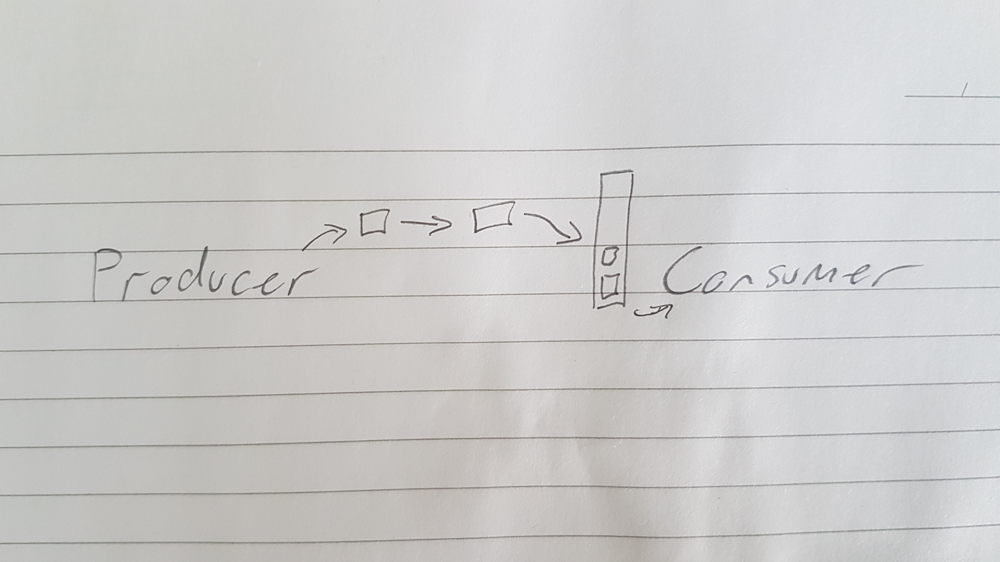
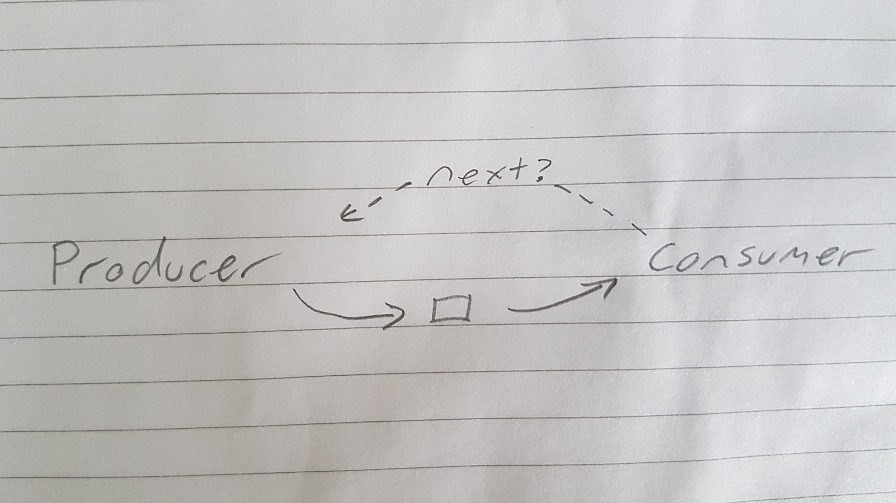
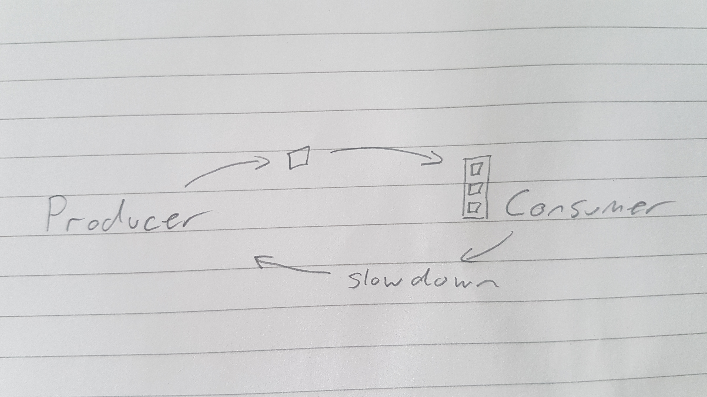
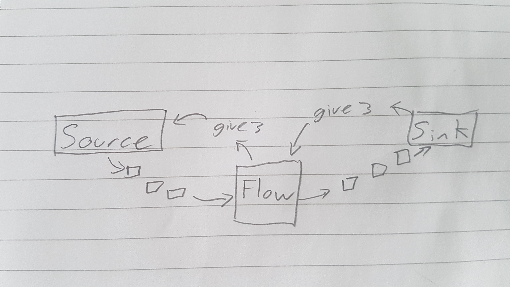

class: center, middle

# Akka Streams

by Stephen Nancekivell

@StephenNancekiv

---

# Agenda

* reactive streams
  * what are streams
  * back pressure & reactive streams
* Akka streams
  * Example
  * Cool features
  * Community

---

# Who Am I

Stephen Nancekivell

.
## Lightbend
make akka streams http://akka.io

---

# What are streams

* scala.collection.Stream
* Java 8 streams
* Spark streaming
* kafka streaming, AWS kinesis, google pub sub
* ActiveMQ and friends
* iterator

---

# Properties of streams

* infinite data
* cant fit in memory
* processed item by item


can perform many collection operations
* map
* filter

cant perform
* exists
* size

---

# Producers Consumers

```scala
Producer ~> B ~> C ~> Consumer
```

---

# Producers Consumers

```scala
Producer ~> B ~> C ~> Consumer
```


akka terminology
```scala
Source ~> Flow ~> Sink
```

---
class: center, middle

# Push or Pull

---

# Push

.center[.w100[]]

---

# Push

* drop
* overflow
* block
* retry

---

# Pull

.center[.w100[]]

---

# Pull

* twice the latency
* polling

---

# Optimizeing Push

Fast producer
.center[.w100[]]

---

# Back Pressure

.center[.w100[]]

---

# Akka Streams

Dynamic Push Pull

Communicates demand

---

# Akka Streams

.center[.w100[]]

---

# Akka Streams

Slow consumer effectively pull

Slow producer effectively push

---

# Reative Streams

reactive-streams.org

Is a interface project. Not an implementation.

Joint effort between different groups in industry.

Netflix, Pivotal (SpringSource), Red Hat, Twitter, Lightbend, Oracle, ...

---

# Reative Streams

* Java 9 flow
* rxJava
* slick(Relational database)
* reactive mongodb driver
* reactive kafka
* akka streams
* fs2 (formerly scalaz-streams)
* swave

---

# Case study

* Credit Karma
** https://engineering.creditkarma.com/data/akka-actors-akka-streams-when-you-should-care

---

# Akka Streams 

```scala
Source ~> Flow ~> Sink
```

Reusable pieces

Lazy

---

# Hello world

```scala
  implicit val system = ActorSystem()
  implicit val mat = ActorMaterializer()

  val out: Future[Done] =
    Source(List(1, 2, 3))
      .map(x => x * x)
      .filter(_ > 3)
      .runWith(Sink.foreach(s => println(s)))
```

---

# Akka Streams Functions

```scala
Flow[A]
  .map(x => fn(x))
  .filter(_ > 2)
  .mapConcat(item => makeBatch(item): Seq[?])
  .mapAsync(parallelism = 2)(item => makeFuture(item): Future[?])
```

---

# Akka Streams Functions

```scala
Flow[A]
  .grouped(10)
  .groupedWithin(10, 1.second)
```

---

# Akka Streams Functions

```scala
Flow[A]
  .buffer(100, OverflowStrategy.dropHead)
  .throttle(elements = 10, per = 1.second,
            maximumBurst = 5, mode = ThrottleMode.Shaping)
```

---

# Non Linear Streams

```scala 
  in ~> f1 ~> bcast ~> f2 ~> merge ~> f3 ~> out
              bcast ~> f4 ~> merge

```

---

# Graph DSL

```scala
RunnableGraph.fromGraph(GraphDSL.create() { implicit builder: GraphDSL.Builder[NotUsed] =>
  import GraphDSL.Implicits._
  val in = Source(1 to 10)
  val out = Sink.ignore
 
  val bcast = builder.add(Broadcast[Int](2))
  val merge = builder.add(Merge[Int](2))
 
  val f1, f2, f3, f4 = Flow[Int].map(_ + 10)
 
  in ~> f1 ~> bcast ~> f2 ~> merge ~> f3 ~> out
              bcast ~> f4 ~> merge
              
  ClosedShape
})
```

Graph can be treated as a flow.

---

# Community

Alpakka Project
http://github.com/akka/alpakka

Others

reactive kafka

---

# Where is it used

* streaming
* batch job
* akka-http
* ETL

---

# Futher Info
* lightbend confrence presentations, Konrad, Viktor
* Akka docs, really good.


# Thanks to
* lightbend team

---

# Questions

---

# End

---


So for a push API its very important that you ou know how fast each step is.
For resource allocation, to prevent errors. Which is a maintaince burden, particulalry in a changing environment. Or where network latencies are a factor.

Back pressure is the idea of slowing down a producer when the consumer cant keep up, and it has lots of nice properties.
* You dont need to worry about buffer overflow
* you can keep buffer bloat to a minimum.
* decrease latencies
---

# When this shit gets hard with out back pressure

# Async or sync streaming

Great for non blocking api's. which lead to efficent code. So your treating all code as if it were async, like it were over a network, and its so easy.

You dont have to guess how slow each step is and allocate thread pools fear each step in the process.

---

# batch vs streams

Counter example mongo s3 uploader task, 

A complicated process with parallel steps is impossible to optimze. The time each step takes is outside of your control.

But where you have to say stage1 needs 4 threads, stage 2 only needs 1 thread, stage3 needs 8. These are all doing IO, there performance is based on network or disk latencies which can change outside your control.

---

# promise

I have this false promise, if you use akka streams you will never have to do that again. You just describe the steps and the back pressure will take care of optimizing for you.

Big claim.
Dont actually hold me to it, I dont believe in silver bullets. But thats the ideal for we should test against, we should challenge.


# batch rant 

Batch processing has a lot of easy optimizations, you can use batch database operations, do in memory lookups etc.
But we need to be careful with batch sizes,, batch must fit in memory, must make sure we dont crash down stream, database api, web rest api. 

Stream processing, we can make use of micro batching, but without the right tools its going to be harder. How do you join a updating-database to stream processing.

Can we describe a case, where batch process is obvious. Streaming micro batching different steps behave at different rates.

Fast data.
https://www.lightbend.com/blog/fast-data-architectures-for-streaming-applications-free-oreilly-mini-book-by-dean-wampler


